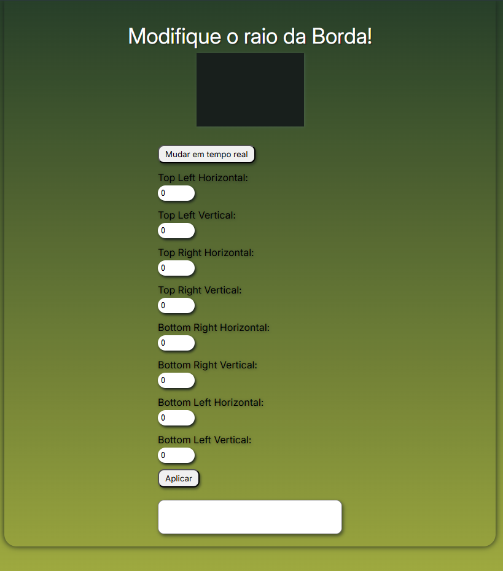

# Border Radius Previewer

## Descrição

Este projeto é uma ferramenta interativa que permite aos usuários modificar os valores dos raios das bordas de um elemento `div` e visualizar as mudanças em tempo real ou após clicar em um botão "Aplicar". A ferramenta é útil para desenvolvedores web que desejam experimentar diferentes valores de `border-radius` para criar formas complexas.

## Funcionalidades

- Modificação dos valores dos raios das bordas (horizontal e vertical) para os quatro cantos de um elemento `div`.
- Alternância entre a visualização das mudanças em tempo real e a aplicação das mudanças após clicar em um botão.
- Exibição do código CSS gerado para os valores de `border-radius`.

## Tecnologias Utilizadas

- HTML5
- CSS3
- JavaScript

## Estrutura do Projeto

- `index.html`: Contém a estrutura HTML do projeto.
- `style.css`: Contém os estilos CSS para o layout e a aparência do projeto.
- `script.js`: Contém o código JavaScript para a funcionalidade interativa do projeto.

## Como Usar
Link do site: https://joaogabriel43.github.io/BorderRadiusPreviewer/

1. Clone o repositório para o seu ambiente local:
    ```bash
    git clone https://github.com/joaogabriel43/border-radius-previewer.git
    ```

2. Navegue até o diretório do projeto:
    ```bash
    cd border-radius-previewer
    ```

3. Abra o arquivo `index.html` no seu navegador preferido.

## O que Aprendi

Ao desenvolver este projeto, aprendi:

- Como manipular o DOM usando JavaScript para criar uma interface interativa.
- Como utilizar eventos de entrada (`input`) e clique (`click`) para atualizar elementos da página.
- Como aplicar e ajustar estilos CSS dinamicamente usando JavaScript.
- A importância de uma boa estrutura de código e organização de arquivos em um projeto web.
- Como utilizar variáveis CSS (`:root`) para gerenciar cores e outros valores de forma eficiente.
- A importância de uma boa experiência do usuário, permitindo alternar entre modos de visualização em tempo real e após aplicação.

## Capturas de Tela



## Contribuição

Se você quiser contribuir para este projeto, sinta-se à vontade para abrir uma issue ou enviar um pull request.

---

Feito com ❤️ por [João Gabriel B N](https://github.com/joaogabriel43)

## English Below

# Border Radius Previewer

## Description

This project is an interactive tool that allows users to modify the border radius values of a `div` element and see the changes in real-time or after clicking an "Apply" button. The tool is useful for web developers who want to experiment with different `border-radius` values to create complex shapes.

## Features

- Modify the border radius values (horizontal and vertical) for the four corners of a `div` element.
- Toggle between real-time changes and applying changes after clicking a button.
- Display the generated CSS code for the `border-radius` values.

## Technologies Used

- HTML5
- CSS3
- JavaScript

## Project Structure

- `index.html`: Contains the HTML structure of the project.
- `style.css`: Contains the CSS styles for the layout and appearance of the project.
- `script.js`: Contains the JavaScript code for the interactive functionality of the project.

## How to Use

Site link: https://joaogabriel43.github.io/BorderRadiusPreviewer/

1. Clone the repository to your local environment:
    ```bash
    git clone https://github.com/joaogabriel43/border-radius-previewer.git
    ```

2. Navigate to the project directory:
    ```bash
    cd border-radius-previewer
    ```

3. Open the `index.html` file in your preferred browser.

## What I Learned

By developing this project, I learned:

- How to manipulate the DOM using JavaScript to create an interactive interface.
- How to use input (`input`) and click (`click`) events to update page elements.
- How to dynamically apply and adjust CSS styles using JavaScript.
- The importance of good code structure and file organization in a web project.
- How to use CSS variables (`:root`) to efficiently manage colors and other values.
- The importance of a good user experience, allowing toggling between real-time and after-apply modes.

## Screenshots


## Contribution

If you want to contribute to this project, feel free to open an issue or submit a pull request.

---

Made with ❤️ by [João Gabriel B N](https://github.com/joaogabriel43)
